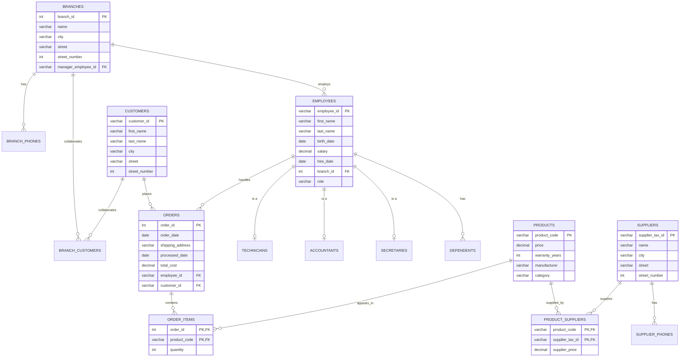
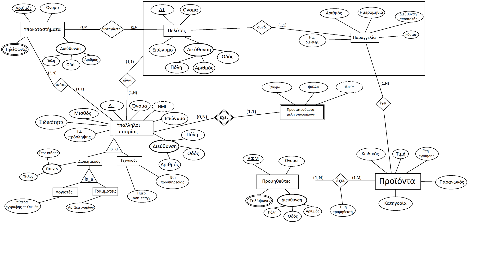

# ER Diagram — Modernized Reconstruction

The diagram below is a clean GitHub-oriented reconstruction of the data model. It is not presented as the original 2017 diagram.

```mermaid
erDiagram
    BRANCHES ||--o{ BRANCH_PHONES : has
    BRANCHES ||--o{ EMPLOYEES : employs
    BRANCHES ||--o{ BRANCH_CUSTOMERS : collaborates
    CUSTOMERS ||--o{ BRANCH_CUSTOMERS : collaborates
    CUSTOMERS ||--o{ ORDERS : places
    EMPLOYEES ||--o{ ORDERS : handles
    EMPLOYEES ||--o| TECHNICIANS : "is a"
    EMPLOYEES ||--o| ACCOUNTANTS : "is a"
    EMPLOYEES ||--o| SECRETARIES : "is a"
    EMPLOYEES ||--o{ DEPENDENTS : has
    ORDERS ||--o{ ORDER_ITEMS : contains
    PRODUCTS ||--o{ ORDER_ITEMS : appears_in
    PRODUCTS ||--o{ PRODUCT_SUPPLIERS : supplied_by
    SUPPLIERS ||--o{ PRODUCT_SUPPLIERS : supplies
    SUPPLIERS ||--o{ SUPPLIER_PHONES : has

    BRANCHES {
        int branch_id PK
        varchar name
        varchar city
        varchar street
        int street_number
        varchar manager_employee_id FK
    }
    CUSTOMERS {
        varchar customer_id PK
        varchar first_name
        varchar last_name
        varchar city
        varchar street
        int street_number
    }
    EMPLOYEES {
        varchar employee_id PK
        varchar first_name
        varchar last_name
        date birth_date
        decimal salary
        date hire_date
        int branch_id FK
        varchar role
    }
    ORDERS {
        int order_id PK
        date order_date
        varchar shipping_address
        date processed_date
        decimal total_cost
        varchar employee_id FK
        varchar customer_id FK
    }
    PRODUCTS {
        varchar product_code PK
        decimal price
        int warranty_years
        varchar manufacturer
        varchar category
    }
    SUPPLIERS {
        varchar supplier_tax_id PK
        varchar name
        varchar city
        varchar street
        int street_number
    }
    ORDER_ITEMS {
        int order_id PK,FK
        varchar product_code PK,FK
        int quantity
    }
    PRODUCT_SUPPLIERS {
        varchar product_code PK,FK
        varchar supplier_tax_id PK,FK
        decimal supplier_price
    }
```

## Original diagram

